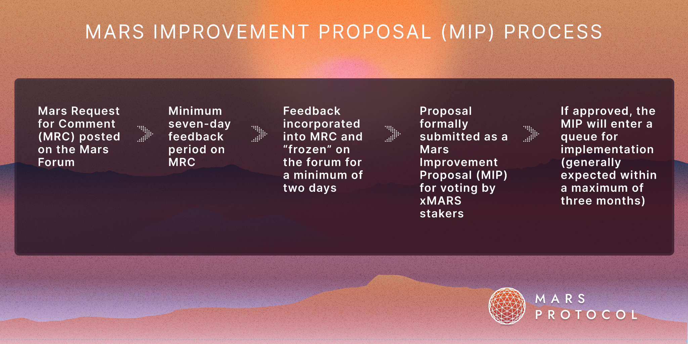

**Mars Improvement Proposals (MIPs)**

Mars Improvement Proposals are the main mechanism for improving the Mars Protocol as well as funding and coordinating the Martian Council. MIPs provide a mechanism for any community member to define key issues and suggest changes and additions to the system.

The following timeline gives an overview of the MIP process:

**Overview**

**Definitions**

**MIPs**

MIPs are standardized documents subject to community feedback and voting that, once enacted, define the behavior of the Martian Council and the Mars Protocol.

There are two possible categories of MIPS:

1. **Signaling proposals:** Changes that DO NOT alter Mars’ canonical smart contract code or parameters such as UI updates on marsprotocol.io. This category can be adopted through non-binding social-signal-boosting of support.
2. **Binding proposals:** Changes that DO alter Mars’ canonical smart contract contract code or parameters. This category requires a successful on-chain vote before a specific proposal can be implemented.

Binding proposals impact the canonical Mars Protocol smart contracts and have four possible sub-categories:

1. **Technical Proposals:** Proposals for changes to the smart contract code within the canonical implementation of the Mars Protocol.
2. **Red Bank Asset Listing Proposals:** Proposals to add or remove support for one or more new assets within the Red Bank.
3. **Credit Line Extension Proposals:** Proposals from developers aiming to secure a virtual “credit line” from the Red Bank for unique applications such as leveraged yield farming.
4. **General Proposals:** All other proposals impacting areas such as the treasury, governance, and tokenomics.

If you feel that your API does not fit in any pre-existing sub-categories, you can simply leave it as General.

**Authoring and Proposing**

MIPs can be brought forth and proposed by anyone.

If you're interested in proposing a MIP, please read below for more details around the lifecycle of a MIP as well as templates you should use to submit your ideas to the Mars community.

**Getting Started with MIPs (for Authors)**

MIPs are written using Markdown and hosted on GitHub. Please note that all MIPs (and their associated MRCs) must conform to specific templates!

**Markdown**

Markdown is a very simple markup language for formatting text, i.e., adding headers, bullet lists, italicized text, et cetera. When working with MIPs, you should use GitHub-flavored Markdown.

> GitHub’s Mastering Markdown will get you up to speed in no time. The online Markdown editor HackMD is a solid platform for practice and production.
> 

**GitHub**

[GitHub](https://github.com/) is a code hosting platform for version control and collaboration built on [git](https://git-scm.com/), a version control software. GitHub is complex and may seem daunting at first, but only a basic familiarity is necessary for our purposes.

> We recommend that you read these two short guides: Hello World and Forking Projects.
> 

**Templates**

- Technical MIPs must conform to the Technical MIP Template.
- Red Bank Asset Listing MIPS must conform to the Red Bank Asset Listing MIP Template.
- Credit Line Extension MIPs must conform to the Credit Line Extension MIP Template.
- General MIPs must conform to the General MIP Template.

**Proposing**

Once you've picked the appropriate template for your proposal and have a workable draft, the next steps are the following two tasks:

- Post an Mars Request for Comment (MRC) on the [Mars Forum](https://forum.marsprotocol.io/) (note that Red Bank Asset Listing Proposals and Credit Line Extension proposals must include a risk framework analysis as detailed here: [Red Bank Asset Listing Risk Framework](https://github.com/mars-protocol/mips/Red-Bank-Asset-Listing-Framework.md) and [Credit Line Extension Risk Framework](https://github.com/mars-protocol/mips/Credit-Line-Extension-Risk-Framework.md))
- Submit the MRC to the GitHub MIP repository

After the two above tasks have been completed, MIP Editors will help assign a number for the proposal. The proposed MRC will then enter a period of community feedback. This is a great opportunity to iterate on your proposal. Once the feedback period is over and you've incorporated your final changes, there will be a one-week period before you can formally submit the proposal for voting as an MIP. Lastly, your proposal will go through a voting period.

For a more detailed breakdown of the full MIP lifecycle, check out MIP-0.

**License**

The MIP framework was inspired by the [Astroport Improvement Proposal Framework](https://github.com/astroport-fi/aips).