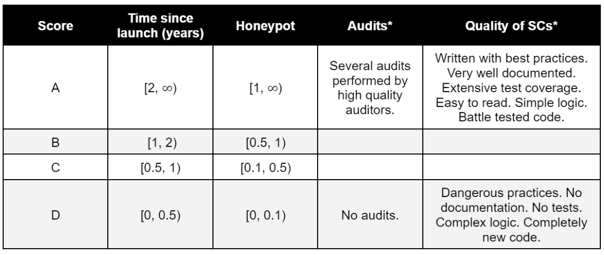
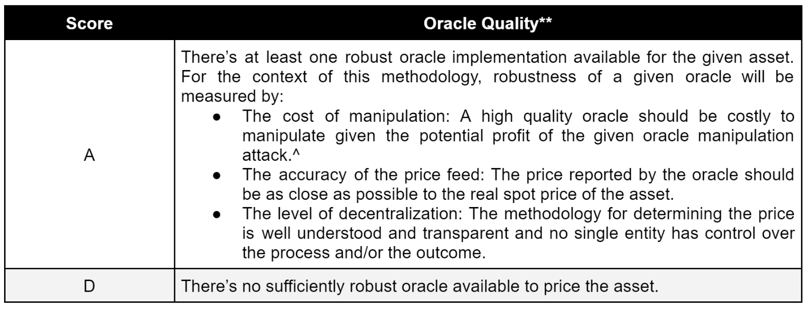

# The Red Bank Asset Listing Risk Framework
The Mars Risk Framework serves two main purposes: 1) Assessing the riskiness of assets to be added to the platform and 2) based on that assessment, setting the risk parameters for those assets. This section describes the Risk Framework in detail. The first section defines certain categories and variables that can be used to assess the riskiness of an asset. The second section describes a methodology for scoring these assets. The last section describes a potential process to set the protocol’s risk parameters.

## Risk categories and measured variables

The Risk Framework evaluates assets in 4 main categories:
* Market Risk: Measures the liquidity and volatility of the asset. 
* Smart Contract (SC) Risk: Measures the riskiness of the asset at the technical layer. 
* Centralization (CP) Risk: Measures the centralization risk of the asset. 
* Oracle Risk: Measures the risks associated with the oracles used to price assets within the protocol.

Each of these categories, in turn, is measured through the following variables:

**Market Risk:**
* Maximum intraday drawdown: Maximum price change (from high to low) in a trading day over the last 365 days. 
* Volatility: Standard deviation of the logarithmic daily returns over the last 90 days. 
* 24hr volume: Average 24hr volume over the last 90 days. 
* Worst 7-day volume: Minimum 7-day average 24hr volume over the last 90 days.

**Smart Contract Risk:**
* Time since launch. 
* Honey pot: Daily sum of the project’s Total Value Locked (TVL) since launch. For standardization purposes, this value is divided by $365B ($1B per day for 365 days) to arrive at the Honey Pot coefficient. 
* Audit quality (Qualitative): Thoroughness and quality of audits performed on the project. 
* Quality of smart contracts (Qualitative): Measures the overall riskiness of the smart contracts. Evaluates the use of best practices, the thoroughness of the tests and the documentation, among other factors.

**Centralization Risk:**
* Team (Qualitative): Evaluates the reputation and integrity of the team behind the project. 
* Key contracts centralization (Qualitative): Measures the level of centralization of the most important contracts of the protocol.

** Oracle Risk:**
* Evaluates the level of decentralization and robustness of the oracle implementation to be used to price a given asset within Mars.

## Scoring Methodology

Each asset will receive a score from A to D in the relevant variables for each category according to the following tables:

**Market Risk:**

**Smart Contract Risk:**

**Centralization Risk:**

**Oracle Risk:**

_^See an example of profit/cost estimation research [here](https://members.delphidigital.io/reports/attack-cost-and-profit-from-manipulating-constant-product-market-maker-twap-oracles-in-defi-protocols/)_

Content on this page should be migrated to GitHub with the title Red Bank Asset Listing Risk Framework: [https://docs.marsprotocol.io/mars-protocol/protocol/welcome-to-mars/red-bank-risk-framework](https://docs.marsprotocol.io/mars-protocol/protocol/welcome-to-mars/red-bank-risk-framework)

Desired destination link: [https://github.com/mars-protocol/mips/Red-Bank-Asset-Listing-Framework.md](https://github.com/mars-protocol/mips/Credit-Line-Extension-MIP-Template.md)